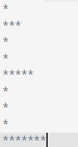

# Algorithms

Problem: Given a number, check if it is a even number or an odd number.

Algorithm 1: Check the divisibility

1. Get the number
2. Check if the number is divisible by 2 (whether it leaves a remainder of 0 when divided by 2)
3. If the number is divisible by 2, then it is an even number
4. If the number is not divisible by 2, then it is an odd number

Algorithm 2: Check the last digit

1. Get the number
2. Find the last digit of the number
3. Check if the last digit is 0, 2, 4, 6, or 8
4. If true => the number is even
5. If false => the number is odd

Algorithm 3: Generate the sequence

1. Get the number
2. Generate a sequence of numbers starting from 0
3. Check if the number is in the sequence
4. If the number is in the sequence, then it is an even number
5. If the number is not in the sequence, then it is an odd number

# Homeworks

1. Given a number, check if it is a prime number or not.
2. Given a number, check if it is a palindrome number or not.
3. Given a number, check if it is a perfect number or not.
4. Given a number, check if it is a happy number or not.
5. Given a number, check if it is a fibonacci number or not.
6. Given a number, check if it is a armstrong number or not.
7. Given two numbers, find the greatest common divisor (GCD) of the two numbers.
8. Given two numbers, find the least common multiple (LCM) of the two numbers.
9. Given a number, find the factorial of the number.
10. Given a number, find the sum of the digits of the number.
11. Given a number, find the reverse of the number.
12. Given a number, find the number of digits in the number.
13. Given a number, find the number of prime factors of the number.
14. Find the nth number in the fibonacci sequence.
15. Find the nth prime number.

## Suggestions

- LCM
- GCD
- Happy number
- nth prime number

Happy Number: A number is called happy if it leads to 1 after a sequence of steps wherein each step number is replaced by the sum of squares of its digit that is if we start with Happy Number and keep replacing it with digits square sum, we reach 1.

Example:

19 is Happy Number,

1^2 + 9^2 = 82 => 8^2 + 2^2 = 68 => 6^2 + 8^2 = 100 => 1^2 + 0^2 + 0^2 = 1

So, 19 is a Happy Number.

Examples: 1, 7, 10, 13, 19, 23, 28, 31, 32, 44, 49, 68, 70, 79, 82, 86, 91, 94, 97, 100

The numbers which are not Happy are called Unhappy Numbers.

Examples: 2, 3, 4, 5, 6, 8, 9, 11, 12, 14, 15, 16, 17, 18, 20, 21, 22, 24, 25, 26, 27, 28, 30

## Patterns

Homeworks from Guvi/Codekata/Patterns

## Schedule

Day 1: 21st Oct: Problem Solving Techniques
Day 2: 22nd Oct: Patterns
Day 3: 23rd Oct: Arrays - Basics
Day 4: 24th Oct: Arrays - Advanced + Time Complexity
Day 5: 25th Oct: Strings - Basics
Day 6: 28th Oct: Strings - Advanced
Day 7: 30th Oct: Sorting Algorithms - Bubble, Insertion, Selection, Counting, Merge
Day 8: 2nd Nov: Searching Algorithms - Linear, Binary, Ternary
Day 9: 3rd Nov: Linked Lists - Singly, Doubly, Circular
Day 10: 4th Nov: Stacks and Queues

# Arrays - Basic Problems (Homeworks + Exercises)

1. Given an array of integers and the number, find only the factors of the number.
2. Given two arrays, find the common elements between the two arrays.
3. Given an array of integers, find the maximum element in the array.
4. Given an array of numbers, find the frequency of each element in the array.
5. Given an array of integers, find the sum of all the elements in the array.
6. Given an array of integers, find the first non-repeating element in the array.
7. Given two sorted arrays, merge the two arrays into a single sorted array.

Example:

Input: [1, 3, 5], [2, 4, 6]
Output: [1, 2, 3, 4, 5, 6]

Algorithm 1: Merge and Sort

1. Get the two arrays
2. Merge the two arrays into a single array
3. Sort the merged array
4. Return the sorted array

Time Complexity: O(m + n)

Algorithm 2: Insertion Sort

1. Get the two arrays
2. Iterate the smallest array
3. For each element in the smallest array, insert the element into the largest array at the correct position
4. Return the largest array

Time Complexity: O(m \* n)

Algorithm 3: Merge Sort

1. Get the two arrays
2. Place two pointers at the start of the two arrays
3. Create a new array <- mergedArray
4. Compare the elements at the two pointers
5. If the element in the first array is smaller, add it to the mergedArray and increment the pointer in the first array
6. If the element in the second array is smaller, add it to the mergedArray and increment the pointer in the second array
7. Repeat the process until the end of the arrays
8. After the end of the arrays, add the remaining elements in the arrays to the mergedArray
9. Return the mergedArray

Time Complexity: O(m + n)

10. Given an array of integers, find the second largest element in the array.
    **9. Given an array of integers, find the kth largest element in the array.**
    **9. Given an array of integers and a number, find the number of pairs of elements in the array whose sum is equal to the given number.**
    **11. Given a list of numbers, find the maximum sum of subarray.**
11. Given an array of numbers and 0's, move all the 0's to the end of the array.
    **10. Given an array of integers, find the maximum difference between two elements in the array such that the smaller element appears before the larger element.**
    **14. Given an array of integers, find and print all the combinations of the elements in the array.**
12. Given an array and a value k, rotate the array to the right by k steps.

# Time Complexity

In order to compare the efficiency of the algorithms, we need the performance metrics.

1. Time Complexity: The amount of time required by the algorithm to run as a function of the input size.
2. Space Complexity: The amount of memory required by the algorithm to run as a function of the input size.

To represent the time complexity, mathematically, we have notations called as "Asymptotic Notations".

Asymptotic Notations:

1. Big O Notation: Upper Bound
2. Omega Notation: Lower Bound
3. Theta Notation: Tight Bound

From these we use the Big O Notation to represent the time complexity of the algorithms. (Worst Case)

Example:

Given an array of elements and an element to search, if we use linear search algorithm, the different cases are:

numbers = [1, 2, 3, 4, 5, 6, 7, 8, 9, 10]
element = 1 (first element)

comparisons or execution steps: 1

The above is called as the best case scenario. The time complexity of the algorithm is O(1).

numbers = [1, 2, 3, 4, 5, 6, 7, 8, 9, 10]
element = 5 (middle element)

comparisons or execution steps: 5

The above is called as the average case scenario. The time complexity of the algorithm is O(n/2) => O(n).[Because 1/2 is a constant and we ignore constants]

numbers = [1, 2, 3, 4, 5, 6, 7, 8, 9, 10]
element = 10 (last element) or 11 (element not in the array)

comparisons or execution steps: 10

The above is called as the worst case scenario. The time complexity of the algorithm is O(n).

# Two Pointers Technique

- Problem: Given two sorted arrays, merge the two arrays into a single sorted array.

# Hashing Technique

- Problem: Given an array, find and print the frequency of each element in the array.

Input: [1, 2, 3, 4, 5, 1, 2, 3, 4, 1, 2, 1, 1, 1, 1]

Output: {1: 7, 2: 3, 3: 2, 4: 2, 5: 1}

- Problem: Given an array, find and print the first non-repeating element in the array.

Input: [1, 2, 3, 4, 5, 1, 2, 3, 4, 5, 6]

Output: 6

- Problem: Given an array, remove all the duplicates in the array.

Input: [1, 2, 3, 4, 5, 1, 2, 3, 4, 5, 6]

Output: [1, 2, 3, 4, 5, 6]

- Problem: Given an array, remove all the duplicates along with the first occurrence of the element and print the remaining elements.

Input: [1, 2, 3, 4, 5, 1, 2, 3, 4, 5, 6]

Output: [6]

- Problem: Given an array, find and print the common elements between the two arrays.

Input: [1, 2, 3, 4, 5], [2, 4, 6]

Output: [2, 4]

- Problem: Given an array, find the most occuring element.

Input: [1, 2, 3, 4, 5, 1, 2, 3, 4, 1, 2, 1, 1, 1, 1]

Output: 1

- Problem: Given an array, find the least occuring element.

Input: [1, 2, 3, 4, 5, 1, 2, 3, 4, 1, 2, 1, 1, 1, 1]

Output: 5

# Time Complexity Exercises

```javascript
let m, n;
let a, b;

for (let i = 0; i < m; i++) {
  a = a + Math.random();
}

for (let i = 0; i < n; i++) {
  b = b + Math.random();
}
```

Options:

1. O(1)
2. O(log n)
3. O(n)
4. O(n log n)
5. O(n^2)
6. O(2^n)
7. O(n!)

Solution:

```javascript
let m, n;
let a, b;
```

number of executions: 1 [Constant time: declarations, assignments, expressions, initializations, if conditions, etc.]

```javascript
for (let i = 0; i < m; i++) {
  a = a + Math.random();
}
```

number of executions: m [Linear time: for loop]

```javascript
for (let i = 0; i < n; i++) {
  b = b + Math.random();
}
```

number of executions: n [Linear time: for loop]

Total time complexity,

T(m, n)
= 1 + m + n
= m + n [Ignoring constants]
= O(m + n) [Big O Notation]

```javascript
let n;
let a, b;

for (let i = 0; i < n; i++) {
  a = a + Math.random();
  for (let j = 0; j < n; j++) {
    b = b + Math.random();
  }
}
```

Solution: Method 2

1. Make some assumptions

n = 4
n = 5
n = 6

2. Calculate the number of executions of each of the assumption

n = 4

     i = 0; j = 0, 1, 2, 3; => 4 executions
     i = 1; j = 0, 1, 2, 3; => 4 executions
     i = 2; j = 0, 1, 2, 3; => 4 executions
     i = 3; j = 0, 1, 2, 3; => 4 executions

     Total number of executions: 4 + 4 + 4 + 4 = 16

n = 5

         i = 0; j = 0, 1, 2, 3, 4; => 5 executions
         i = 1; j = 0, 1, 2, 3, 4; => 5 executions
         i = 2; j = 0, 1, 2, 3, 4; => 5 executions
         i = 3; j = 0, 1, 2, 3, 4; => 5 executions
         i = 4; j = 0, 1, 2, 3, 4; => 5 executions

         Total number of executions: 5 + 5 + 5 + 5 + 5 = 25

n = 6

             i = 0; j = 0, 1, 2, 3, 4, 5; => 6 executions
             i = 1; j = 0, 1, 2, 3, 4, 5; => 6 executions
             i = 2; j = 0, 1, 2, 3, 4, 5; => 6 executions
             i = 3; j = 0, 1, 2, 3, 4, 5; => 6 executions
             i = 4; j = 0, 1, 2, 3, 4, 5; => 6 executions
             i = 5; j = 0, 1, 2, 3, 4, 5; => 6 executions

             Total number of executions: 6 + 6 + 6 + 6 + 6 + 6 = 36

3. Generalize the number of executions

n = 4, number of executions: 4^2 = 16
n = 5, number of executions: 5^2 = 25
n = 6, number of executions: 6^2 = 36

For a given n, number of executions: n^2

4. Calculate the time complexity

T(n)
= 1 + n^2
= n^2 [Ignoring constants]
= O(n^2) [Big O Notation]

```javascript
let n;
let a, b;

for (let i = 0; i < n; i++) {
  a = a + Math.random();
  for (let j = i + 1; j >= 0; j--) {
    b = b + Math.random();
  }
}
```

1. Make some assumptions

n = 4
n = 5
n = 6

2. Calculate the number of executions of each of the assumption

n = 4

     i = 0; j = 0; => 1 execution
     i = 1; j = 1, 0; => 2 executions
     i = 2; j = 2, 1, 0; => 3 executions
     i = 3; j = 3, 2, 1, 0; => 4 executions

     Total number of executions: 1 + 2 + 3 + 4 = 10

n = 5

         i = 0; j = 0; => 1 execution
         i = 1; j = 1, 0; => 2 executions
         i = 2; j = 2, 1, 0; => 3 executions
         i = 3; j = 3, 2, 1, 0; => 4 executions
         i = 4; j = 4, 3, 2, 1, 0; => 5 executions

         Total number of executions: 1 + 2 + 3 + 4 + 5 = 15

n = 6

             i = 0; j = 0; => 1 execution
             i = 1; j = 1, 0; => 2 executions
             i = 2; j = 2, 1, 0; => 3 executions
             i = 3; j = 3, 2, 1, 0; => 4 executions
             i = 4; j = 4, 3, 2, 1, 0; => 5 executions
             i = 5; j = 5, 4, 3, 2, 1, 0; => 6 executions

             Total number of executions: 1 + 2 + 3 + 4 + 5 + 6 = 21

3. Generalize the number of executions

n = 4, number of executions: 1 + 2 + 3 = 6
n = 5, number of executions: 1 + 2 + 3 + 4 = 10
n = 6, number of executions: 1 + 2 + 3 + 4 + 5 = 15

for a given n, number of executions = n \* (n+1)/2

4. Calculate the time complexity

T(n)
= 1 + n _ (n+1)/2
= n _ (n+1)/2 [Ignoring constants]
= 1/2(n^2 + n)
= n^2 + n
= n^2 [Considering the highest power]
= O(n^2) [Big O Notation]

```javascript
let n;
let a, b;

for (let i = 1; i <= n; i++) {
  a = a + Math.random();
  for (let j = 2; j <= n; j *= 2) {
    b = b + Math.random();
  }
}
```

1. Make some assumptions

n = 4
n = 5
n = 6

2. Calculate the number of executions of each of the assumption

n = 4, j = 2, 4 => 2 executions
n = 10, j = 2, 4, 8 => 3 executions
n = 20, j = 2, 4, 8, 16 => 4 executions
n = 39, j = 2, 4, 8, 16, 32 => 5 executions
n = 40, j = 2, 4, 8, 16, 32 => 5 executions
n = 41, j = 2, 4, 8, 16, 32 => 5 executions

3. Generalize the number of executions

n = 4, number of executions: 2
n = 10, number of executions: 3
n = 20, number of executions: 4
n = 39, number of executions: 5
n = 40, number of executions: 5
n = 41, number of executions: 5

for a given n, number of executions = log(n)

4. Calculate the time complexity

T(n)
= 1 + n _ log(n)
= n _ log(n) [Ignoring constants]
= O(n log n) [Big O Notation]

Problem: Given a string, find and print all the permutations of the string.

Example:

Input: "abc"

Output: ["abc", "acb", "bac", "bca", "cab", "cba"]

Input: "abcd"

Output: ["abcd", "abdc", "acbd", "acdb", "adbc", "adcb", "bacd", "badc", "bcad", "bcda", "bdac", "bdca", "cabd", "cadb", "cbad", "cbda", "cdab", "cdba", "dabc", "dacb", "dbac", "dbca", "dcab", "dcba"]

Input : "ab"

Output: ["ab", "ba"]

Problem: Given a string, find and print all the combinations of the string.

Example:

Input: "abc"

Output: ["a", "b", "c", "ab", "ac", "bc", "abc"]

Input: "abcd"

Output: ["a", "b", "c", "d", "ab", "ac", "ad", "bc", "bd", "cd", "abc", "abd", "acd", "bcd", "abcd"]

Input: "ab"

Output: ["a", "b", "ab"]

## Strings - Basic Problems (Homeworks + Exercises)

1. Given a string, find and print the length of the string.
2. Given a string, find and print the reverse of the string.
3. Given a string, find and print the number of words in the string.
4. Given a string, find and print the number of vowels in the string.
5. Given a string, find and print the number of consonants in the string.
6. Given a string, convert the string to uppercase and print the string.
7. Given a string, convert the string to lowercase and print the string.
8. Given a string, count the number of uppercase letters, lowercase letters, digits, and special characters in the string.
9. Given a string, check whether the string is a palindrome or not.
10. Given a string, check whether the string is a palindrome or not without using any extra space.
11. Given a two strings, check whether the two strings are anagrams of each other or not.
12. Given a string, find and print the first non-repeating character in the string.
13. Given a string, find and print all the occurences of each character in the string.
14. Given a string, check whether the string has all the alphabets from a to z or not. Assume the string is case-insensitive.
15. Given a string, find the longest substring without repeating characters.
16. Given a string, find the longest palindrome substring in the string.
17. Given two strings, find the longest common substring between the two strings.
18. Given two strings, find the number of occurences of the second string in the first string.
19. Given a string like 'a3b2c1d3', decode the string to 'aaabbcddd'.
20. Given two strings s1 and s2, check whether s2 is a rotation of s1 or not.
21. Given a string, find and print all the permutations of the string.
22. Given a string, find and print all the combinations of the string.
23. Given a binary string, count the number of substrings with an equal number of 0's and 1's.
24. Given a string with parentheses, check whether the string is valid or not.
25. Given a string, sort the characters in the string based on the frequency of the characters.

- String Traversals
- String Operations
- String Manipulations (Strings are immutable)
- Recursion

## Bubble Sort

- Problem: Given an array of integers, find the second largest element in the array.
- Problem: Given an array of integers, find the kth largest element in the array.

## Homeworks

1. Modify the bubble sort algorithm to stop the sorting process if the elements are already sorted.
2. Find the kth largest element in the array using the bubble sort algorithm.
3. Given a nearly sorted array (each element is at most k positions away from its sorted position), sort the array using the insertion sort algorithm.
4. Given two unsorted arrays, merge the arrays into a single sorted array.
5. Given two unsorted arrays, find the median of the two arrays.



### Stacks

Stack:

- A linear data structure that follows the Last In First Out (LIFO) principle.
- LIFO: The element that is inserted last is the element that is deleted first.
- Operations: Push, Pop, Peek, isEmpty.
- Can be implemented in two ways:
  - Using Arrays,
  - Using Linked Lists.
